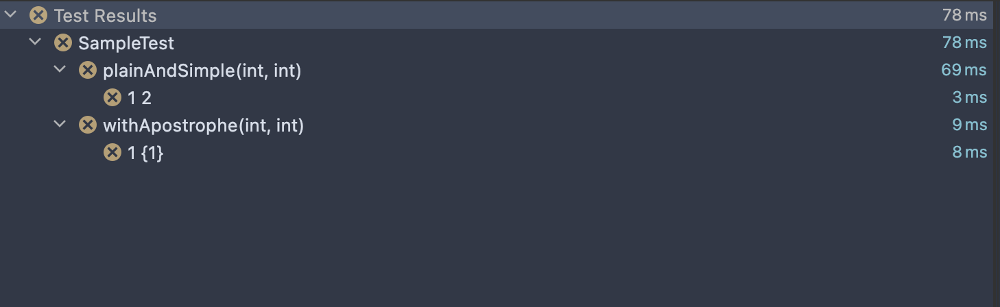

# reproduce issue with junit5 `DisplayName`

When I use an apostrophe in the `name` parameter of the `@ParameterizedTest` annotation, following arguments are not
templated into the output.

[The test](src/test/java/SampleTest.java)

